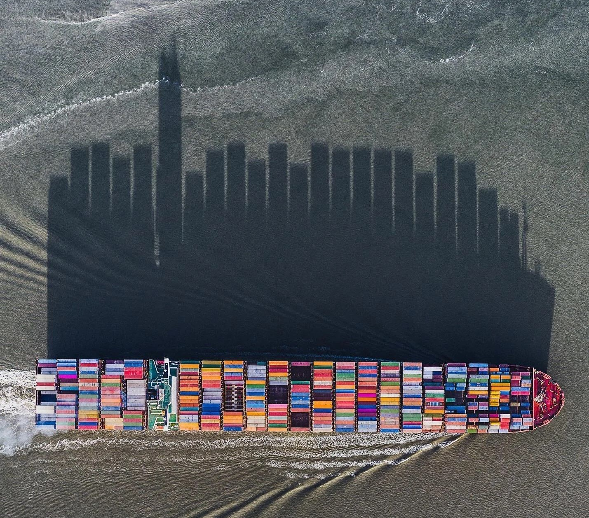

# C062-COMEX-Brasil

  

## About this Project 📊

This project is a **Brazilian Export Dashboard**, developed with **R Shiny** and **bs4Dash** to provide an interactive platform for exploring Brazil's export data between 2011 and 2020. 

The dashboard was created as part of my coursework for **CE062-Dashboards** at the **Federal University of Paraná (UFPR)** under the guidance of Professor Walmes Zeviane. The goal of this project is to offer data-driven insights into Brazil’s export activities, detailing exported products, target countries, economic regions, and other relevant information for analysis.

---

### Dataset 📈

The dataset used in this project is the **Brazilian Exports Dataset**, sourced from [Kaggle](https://www.kaggle.com/datasets/hugovallejo/brazil-exports?select=exportacao_full.csv), originally shared by Hugo Angulo. It includes monthly export data from 2010 to 2020, with information on exporting municipalities, destination countries, export revenue, and product weights.

Given the dataset's size (over 13 million rows), data was aggregated by year and optimized for performance. Additional auxiliary tables were sourced from Brazil’s **Ministry of Development, Industry, Commerce, and Services (MDIC)** to aid in the translation of country names and product categories, ensuring data consistency and integrity.

---

### Features 🛠️

- **Overview Page**: High-level summary of export data with KPIs, time-series analysis, and export destination flows.
- **Regional Export Analysis**: Breakdown of exports by Brazilian regions and states.
- **Destination Insights**: Analysis of major trading partners and economic blocs.
- **Product Details**: Insights into exported product categories and economic sectors.
- **Interactive Filters**: Dynamic filtering synchronized across pages for a cohesive exploration experience.

### Technology Stack 💻

- **R Shiny** and **bs4Dash** for the app interface and structure
- **Highcharter** for rich data visualization
- **ggplot2**, **sf**, and other R packages for data manipulation and mapping
- Auxiliary packages for performance optimization and user interface enhancements

