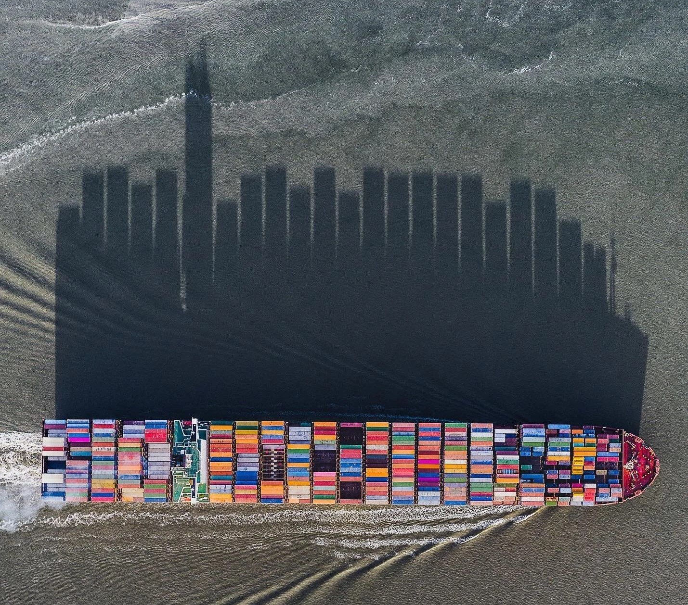

  

---

O presente aplicativo apresenta dados sobre o comércio internacional brasileiro, focando nas exportações de 2011 à 2020.

O conjunto de dados foi criado por <a href='https://www.kaggle.com/hugovallejo' target='_blank'><b>Hugo Angelo</b></a>, 
disponível no <a href='https://www.kaggle.com/datasets/hugovallejo/brazil-exports?select=exportacao_full.csv' target='_blank'><b>Kaggle</b></a>.
O dataset inclui detalhes das exportações realizadas por cidades brasileiras e seus destinos, com informações sobre o Faturamento (em dólares) e o Peso Líquido dos produtos exportados.

Este aplicativo foi desenvolvido como parte do curso de <a href='https://www.est.ufpr.br' target='_blank'><b>Estatística e Ciências de Dados</b></a> na <a href='https://ufpr.br' target='_blank'><b>Universidade Federal do Paraná - UFPR</b></a>, na disciplina de <b>CE062-Dashboards</b>, ministrada pelo professor <a href='https://www.linkedin.com/in/walmes-zeviani/' target='_blank'><b>Walmes Marques Zeviani</b></a>.

O desenvolvimento do aplicativo utiliza a <a href='https://cran.r-project.org/' target='_blank'>linguagem de programação R</a> e o <a href='https://www.rstudio.com/products/shiny/' target='_blank'>Shiny</a> para visualização de dados.

 
Os pacotes utilizados com o <b>R</b> são:

 

- **Desenvolvimento de Aplicativos Web**:
  - [shiny](https://shiny.posit.co/)
  - [bs4Dash](https://rinterface.github.io/bs4Dash/index.html)
  - [fresh](https://dreamrs.github.io/fresh/)
  - [shinyWidgets](https://dreamrs.github.io/shinyWidgets/) 

 
  
- **Visualização de Dados**:
  - [highchart](https://jkunst.com/highcharter/index.html)

 
  
- **Preparação e Limpeza de Dados**: 
  - [tidyverse](https://www.tidyverse.org/)
  

