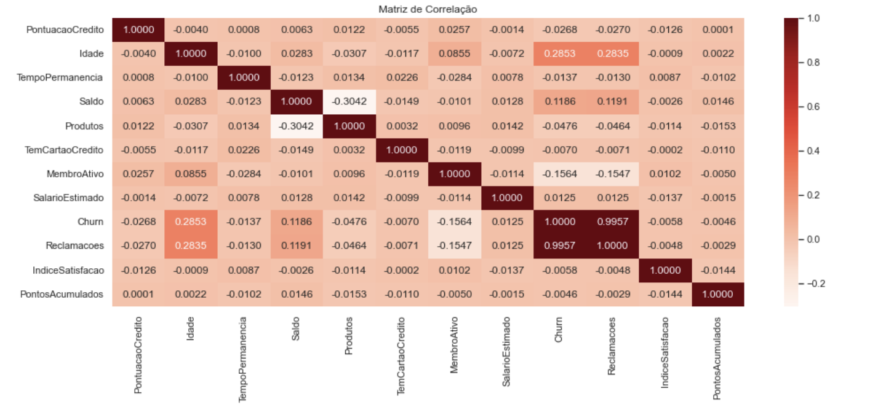
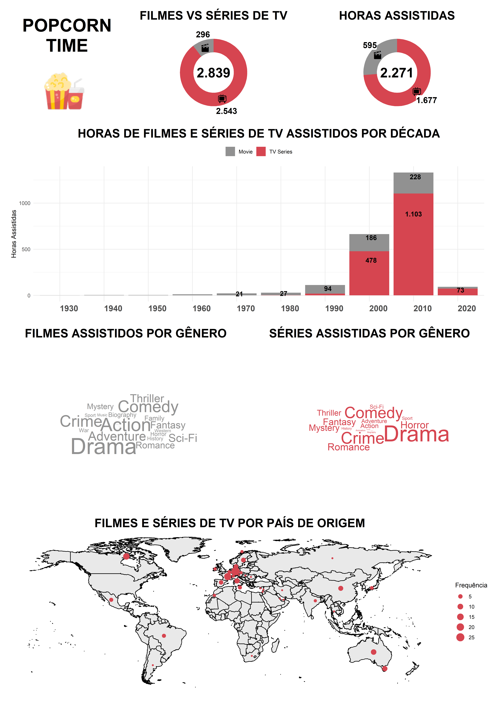

## Análise de Churn em uma Instituição Financeira

  

    
  

### Projeto de Aprendizagem de Máquina

Estudo de caso sobre churn em uma instituição financeira utilizando técnicas de Machine Learning.

[Link para o projeto](https://raymz1990.github.io/Projeto_MachineLearning/)

  

    Construção de modelo de dados para a predição de saídas de clientes.
  

  
  **Autores**: Leonardo Gonçalves Fischer e Raymundo Eduardo Pilz

  **PDF do Projeto**: [Análise de Churn](other-projects/ANÁLISE_DE_CHURN_EM_UMA_INSTITUIÇÃO_FINANCEIRA.pdf)
  
  **Problemática**: A taxa de churn em uma instituição financeira, que mede a perda de clientes ao longo do tempo, impacta diretamente a receita e a satisfação. Este estudo visa analisar e compreender os fatores que contribuem para o churn e propor estratégias para sua redução.

  **Objetivos**:
  - Análise exploratória dos indicadores e características dos clientes.
  - Identificar variáveis com maior correlação com o churn.
  - Construir modelos de predição de churn usando Machine Learning.
  - Comparar modelos e propor recomendações estratégicas para redução da taxa de churn.

  **Fonte de Dados**: Disponível em [Kaggle](https://www.kaggle.com/datasets/radheshyamkollipara/bank-customer-churn).

  Este trabalho foi desenvolvido na disciplina *CE329 - Aprendizagem de Máquina* (2023), sob orientação do professor **Eduardo Vargas Ferreira**, Universidade Federal do Paraná (UFPR).

---

## Análise Financeira de Crédito Bancário

  

    
  

### Visualização de Dados Aplicada

[Dashboard Análise de Crédito Bancário](https://app.powerbi.com/view?r=eyJrIjoiN2Y1M2IyMzgtN2E1Zi00MGY4LTg0NWMtMzY2MjdiZmZlMmE3IiwidCI6ImMzN2IzN2EzLWU5ZTItNDJmOS1iYzY3LTRiOWI3MzhlMWRmMCJ9)

  

    Projeto desenvolvido para a disciplina CE303 – Visualização de Dados Aplicada.
  

  **Escopo e Dados**: Participação em um processo seletivo para uma grande empresa financeira. Foi fornecido o dataset Statlog (German Credit Data) para análise de crédito, disponível em [UCI Machine Learning Repository](https://archive.ics.uci.edu/dataset/144/statlog+german+credit+data).

  **Tarefa**: Construir um dashboard que visualize os resultados mais relevantes e documente o processo de criação.

  Trabalho realizado no 2º período (2023) sob orientação do professor **Anderson Ara** pela Universidade Federal do Paraná (UFPR).

---

## Popcorn Time

  

    
  

### Visualização de Dados de Filmes

Relatório com visualizações sobre filmes e séries de TV.

[Projeto Popcorn Time](https://raymz1990.github.io/CE303-Popcorn-Time/)

  

    Projeto desenvolvido para a disciplina CE303 – Visualização de Dados Aplicada.

- **Projeto disponível também no PowerBI**: 
  - [IMDB Watchlist](https://app.powerbi.com/view?r=eyJrIjoiOGVlMzIzMjktOGZjNi00YWZkLWE1OTMtNGI3NDM3NmI1MjQwIiwidCI6ImMzN2IzN2EzLWU5ZTItNDJmOS1iYzY3LTRiOWI3MzhlMWRmMCJ9)
  

